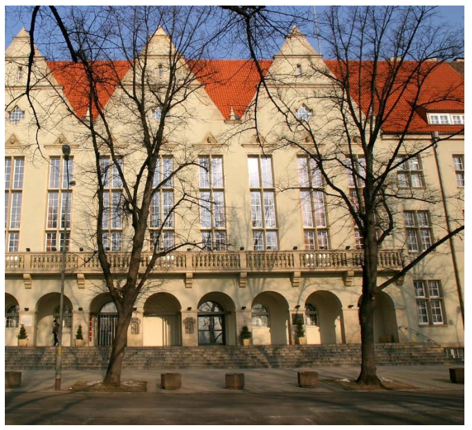

Szanowni Państwo,

Zapraszamy na XXXV, jubileuszowe, Krajowe Sympozjum Telekomunikacji i Teleinformatyki (KSTiT), które w 2019 roku odbędzie się we Wrocławiu. Po raz pierwszy KSTiT zostanie zorganizowane wspólnie z Krajową Konferencją Radiokomunikacji, Radiofonii i Telewizji (KKRRiT) – pod wspólnym hasłem „Internet Wszechrzeczy – dla wszystkich i wszędzie”. Będzie to wspaniała okazja spotkania i integracji specjalistów z obu, coraz bardziej przenikających się, środowisk. Zaproszenie kierujemy do osób świata nauki, w tym młodych pracowników i doktorantów, a także przedstawicieli przemysłu. Liczymy na obecność przedstawicieli dostawców systemów i usług telekomunikacyjnych, integratorów, operatorów i organów regulacyjnych, a także przedstawicieli administracji państwowej i samorządowej, którzy w swej działalności zajmują się zagadnieniami związanymi z telekomunikacją i teleinformatyką. Sądzimy, że zorganizowanie obu konferencji w jednym tygodniu stworzy możliwość prezentacji osiągnięć i wymiany doświadczeń środowisk naukowych, badawczych, przemysłowych i usługowych zajmujących się szeroko pojętą telekomunikacją.

Krajowe Sympozjum Telekomunikacji i Teleinformatyki (KSTiT) odbędzie się 26 czerwca 2019 r. we Wrocławiu. Spotkanie organizuje Katedra Telekomunikacji i Teleinformatyki Wydziału Elektroniki Politechniki Wrocławskiej

Sympozjum organizowane jest już od ponad trzydziestu lat, a jego głównym celem jest wymiana wiedzy, doświadczeń i poglądów między przedstawicielami środowiska akademickiego, jednostek naukowo-badawczych oraz przemysłu. W spotkaniu udział wezmą także operatorzy i regulatorzy rynku.

KSTiT będzie również okazją do prezentacji najnowszych osiągnięć naukowych, kierunków rozwoju oraz zagadnień normalizacyjnych z dziedziny telekomunikacji i teleinformatyki.

[Informacje o konferencji w formie ulotki do wydrukowania.](files/ulotka_KSTiT_2019_v1_DRUK.pdf)

Kontakt: [beata.andrasz@pwr.edu.pl](mailto:beata.andrasz@pwr.edu.pl)
